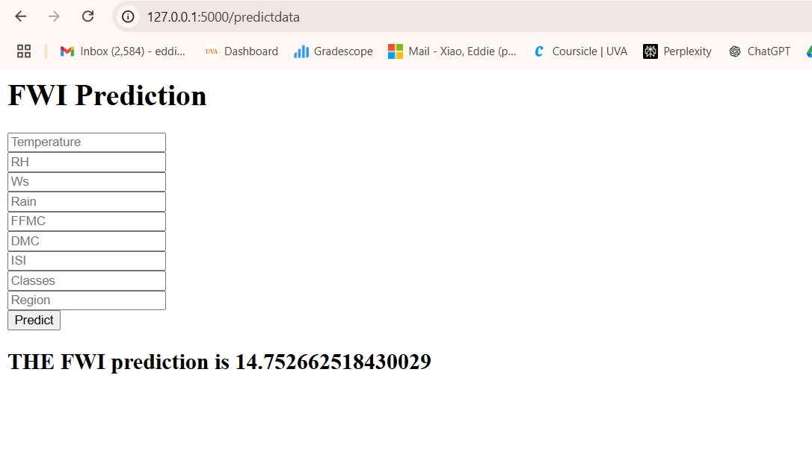

# ML Beginner Project

This project is part of my learning journey from a Udemy course on using Flask and understanding machine learning models.

## Deployment
Coming soon!

## How to Run the Project

1. Clone the repository:
   ```bash
   git clone <repository-link>
2. Navigate to the project directory and run the Flask application:
   python application.py
3. To access the ML prediction page, go to:
   http://localhost:5000/predictdata
4. Enter some numbers, and you'll receive the prediction result!

   
